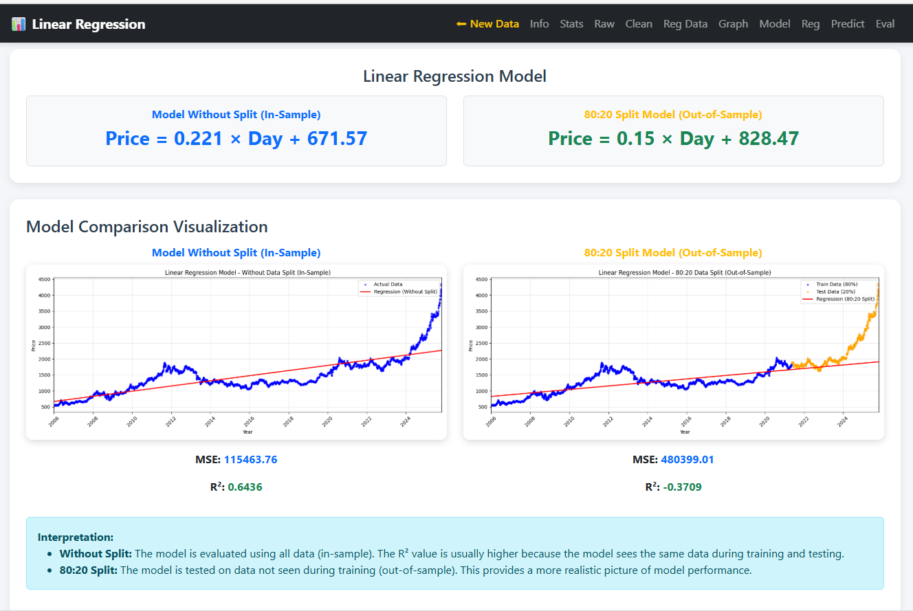

# Gold Simple Linear Regression

This project uses **historical gold price data** sourced from  
**Investing.com**  
https://www.investing.com/commodities/gold-historical-data

A **web-based application** for analyzing gold price data using **Simple Linear Regression**, built with **Flask and Python**.

The application allows users to upload CSV files (derived from the above data source) and automatically generate:

- Descriptive statistics  
- Simple Linear Regression models  
- Model evaluation metrics (**MSE**, **R²**)  
- Data previews and visualizations  
---

## 📊 Preview



---

## 🚀 Features

- Upload CSV files containing gold price data  
- Descriptive statistical analysis  
- Simple Linear Regression (with and without data splitting)  
- Model evaluation using **MSE** and **R²**  
- Tabular data previews:
  - Raw data  
  - Regression results  
  - Prediction results  
- Automatic visualization of regression results  

---

## 🛠️ Tech Stack

- **Python**
- **Flask**
- **Pandas**
- **NumPy**
- **Scikit-learn**
- **Matplotlib**
- **Gunicorn**

---

## 📂 Project Structure

```text
gold-linear-regression/
├── app.py
├── requirements.txt
├── model/
│   └── regression.py
├── templates/
│   ├── index.html
│   └── result.html
├── static/
│   └── *.png
└── README.md
